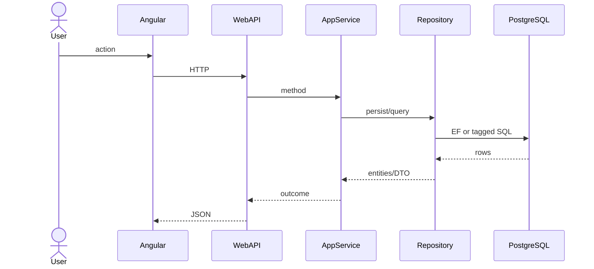

# Feature: {short name}

```yaml
---
id: feat:inv-{slug}
module: inventory
category: master-data   # master-data | transactions | reports
status: draft   # draft | inferred | verified
ui: {angular-route-slug}
api:
  - METHOD path -> Controller.Method
service: {ApplicationServiceName}
repos: []
sql: []
tables: []
upstream: []
downstream: []
---
```

## Purpose

One paragraph: what the user does.

## Entry

| Kind | Value |
|------|-------|
| Menu route | `inventory-module/...` |
| Angular page | `retailr-client/src/app/modules/inventory-module/pages/...` |
| Client service | `.../*.service.ts` |
| API | `METHOD path` |

## Execution



## Code map

| Layer | Type | Path |
|-------|------|------|
| Angular | | `retailr-client/src/app/modules/inventory-module/pages/...` |
| API | | `retailr-server/src/Modules/InventoryModule/InventoryModule.Api/Controllers/...` |
| Service | | `retailr-server/src/Modules/InventoryModule/InventoryModule.Application/Features/...` |
| Repository | | `retailr-server/src/Modules/InventoryModule/InventoryModule.Infrastructure/Persistence/Repositories/...` |
| Entity | | `retailr-server/src/Modules/InventoryModule/InventoryModule.Domain/Entities/...` |

## SQL

| Item | Value |
|------|-------|
| PG functions | |
| Query tags | |

## Tables / columns

Link `docs/schema/{table}.md`. List FKs.

## Permissions

Permission constants under `InventoryModulePermission.*`.

## Dependencies

Upstream / downstream features.

## Gaps

What is inferred vs verified.
