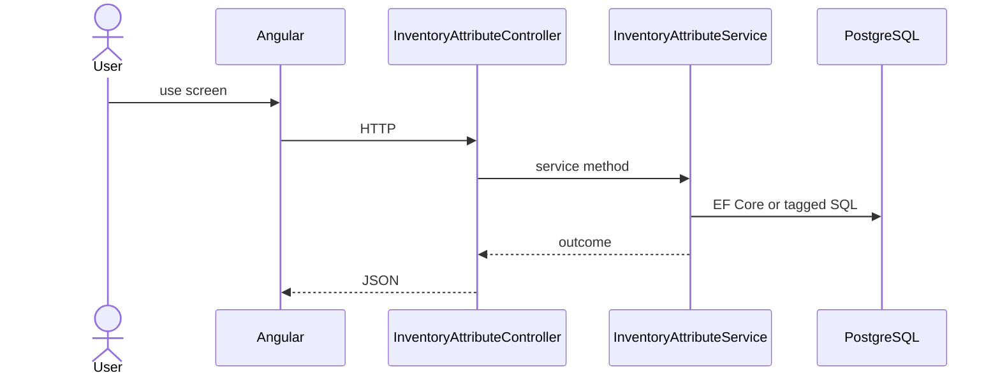

# Feature: Attribute

```yaml
---
id: feat:inv-attribute
module: inventory
category: master-data
status: verified
ui: inventory-attribute
api:
  - POST inventory-attributes -> InventoryAttributeController.Create
  - POST inventory-attributes/copy -> InventoryAttributeController.Copy
  - GET inventory-attributes -> InventoryAttributeController.GetAll
  - GET inventory-attributes/by-category -> InventoryAttributeController.GetAll
  - POST inventory-attributes/query -> InventoryAttributeController.GetAll
  - PUT inventory-attributes/{id} -> InventoryAttributeController.Update
  - GET inventory-attributes/{id} -> InventoryAttributeController.GetById
  - GET inventory-attributes/items -> InventoryAttributeController.GetAllItems
  - GET inventory-attributes/items/non-paginated -> InventoryAttributeController.GetAllItems
  - GET inventory-attributes/color-items/{categoryId} -> InventoryAttributeController.GetColorItems
  - GET inventory-attributes/businessProfile-items/{categoryId} -> InventoryAttributeController.GetBusinessProfileItems
  - POST inventory-attributes/color-items/{categoryId} -> InventoryAttributeController.CreateItem
  - POST inventory-attributes/businessProfile-items/{categoryId} -> InventoryAttributeController.CreateBusinessProfile
service: InventoryAttributeService
repos: []
sql: []
tables: [inventory_attributes, inventory_attribute_items, inventory_category_attributes]
upstream: [feat:inv-category]
downstream: [feat:inv-material, feat:inv-item]
---
```

## Purpose

Attribute definitions and attribute items (including color / business-profile item helpers).

## Entry

| Kind | Value |
|------|-------|
| Menu / routes | `inventory-module/inventory-attribute` |
| Angular page | `retailr-client/src/app/modules/inventory-module/pages/inventory-attribute/` |
| API controller | `retailr-server/src/Modules/InventoryModule/InventoryModule.Api/Controllers/InventoryAttributeController.cs` |
| App service | `retailr-server/src/Modules/InventoryModule/InventoryModule.Application/Features/InventoryAttributeFeatures/` |

## Execution



## Code map

| Layer | Path |
|-------|------|
| Angular | `retailr-client/src/app/modules/inventory-module/pages/inventory-attribute/` |
| Controller | `retailr-server/src/Modules/InventoryModule/InventoryModule.Api/Controllers/InventoryAttributeController.cs` |
| Service | `retailr-server/src/Modules/InventoryModule/InventoryModule.Application/Features/InventoryAttributeFeatures/` |

## Notes

Path segment is literally `businessProfile-items` (camelCase) in the controller.

## Tables

- `tbl:inventory_attributes`
- `tbl:inventory_attribute_items`
- `tbl:inventory_category_attributes`

## Gaps

Controller actions listed from source; stock side-effects inside action-flow verified at service level only where noted.
