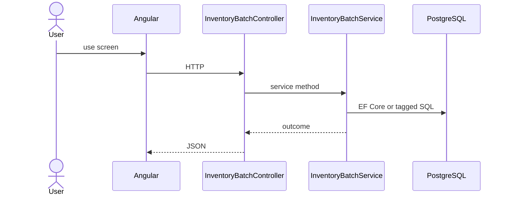

# Feature: Batch

```yaml
---
id: feat:inv-batch
module: inventory
category: master-data
status: verified
ui: inventory-batch
api:
  - POST inventory-batchs -> InventoryBatchController.Create
  - GET inventory-batchs -> InventoryBatchController.GetAll
  - POST inventory-batchs/query -> InventoryBatchController.GetAll
  - PUT inventory-batchs/{id} -> InventoryBatchController.Update
service: InventoryBatchService
repos: []
sql: []
tables: [inventory_batches]
upstream: [feat:inv-item]
downstream: [feat:inv-stock-opening, feat:inv-stock-mrr-rm, feat:inv-stock-issue]
---
```

## Purpose

Lot/batch master tied to inventory items (cost/FIFO).

## Entry

| Kind | Value |
|------|-------|
| Menu / routes | `inventory-module/inventory-batch` |
| Angular page | `retailr-client/src/app/modules/inventory-module/pages/inventory-batch/` |
| API controller | `retailr-server/src/Modules/InventoryModule/InventoryModule.Api/Controllers/InventoryBatchController.cs` |
| App service | `retailr-server/src/Modules/InventoryModule/InventoryModule.Application/Features/InventoryBatchFeatures/` |

## Execution



## Code map

| Layer | Path |
|-------|------|
| Angular | `retailr-client/src/app/modules/inventory-module/pages/inventory-batch/` |
| Controller | `retailr-server/src/Modules/InventoryModule/InventoryModule.Api/Controllers/InventoryBatchController.cs` |
| Service | `retailr-server/src/Modules/InventoryModule/InventoryModule.Application/Features/InventoryBatchFeatures/` |

## Notes

Route spelling is `inventory-batchs` (controller name + `s`).

## Tables

- `tbl:inventory_batches`

## Gaps

Controller actions listed from source; stock side-effects inside action-flow verified at service level only where noted.
