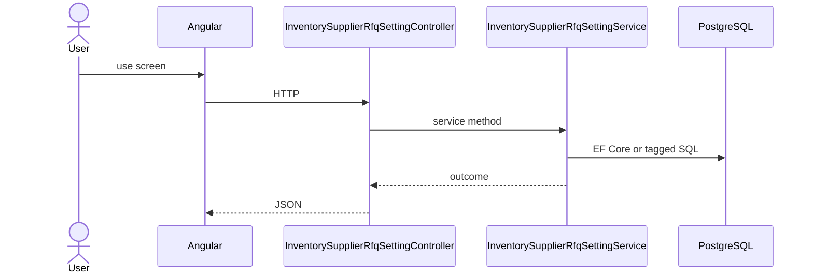

# Feature: Business Profile RFQ Setting

```yaml
---
id: feat:inv-bp-rfq-setting
module: inventory
category: master-data
status: verified
ui: business-profile-rfq-setting
api:
  - POST inventory-supplier-rfq-settings -> InventorySupplierRfqSettingController.Create
  - PUT inventory-supplier-rfq-settings/{id} -> InventorySupplierRfqSettingController.UpdateSupplierRfqSetting
  - POST inventory-supplier-rfq-settings/query -> InventorySupplierRfqSettingController.Get
service: InventorySupplierRfqSettingService
repos: []
sql: []
tables: [inventory_supplier_rfq_settings]
upstream: [feat:inv-material]
downstream: []
---
```

## Purpose

Per-material supplier RFQ settings mapped to business profiles.

## Entry

| Kind | Value |
|------|-------|
| Menu / routes | `inventory-module/business-profile-rfq-setting` |
| Angular page | `retailr-client/src/app/modules/inventory-module/pages/business-profile-rfq-setting/` |
| API controller | `retailr-server/src/Modules/InventoryModule/InventoryModule.Api/Controllers/InventorySupplierRfqSettingController.cs` |
| App service | `retailr-server/src/Modules/InventoryModule/InventoryModule.Application/Features/InventorySupplierRfqSettingFeatures/` |

## Execution



## Code map

| Layer | Path |
|-------|------|
| Angular | `retailr-client/src/app/modules/inventory-module/pages/business-profile-rfq-setting/` |
| Controller | `retailr-server/src/Modules/InventoryModule/InventoryModule.Api/Controllers/InventorySupplierRfqSettingController.cs` |
| Service | `retailr-server/src/Modules/InventoryModule/InventoryModule.Application/Features/InventorySupplierRfqSettingFeatures/` |


## Tables

- `tbl:inventory_supplier_rfq_settings`

## Gaps

Controller actions listed from source; stock side-effects inside action-flow verified at service level only where noted.
