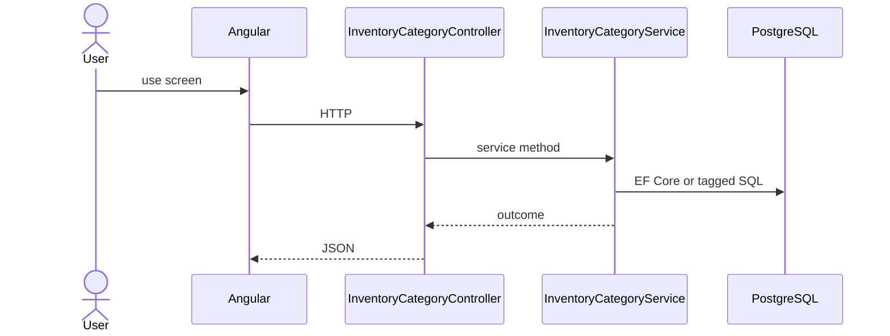

# Feature: Category

```yaml
---
id: feat:inv-category
module: inventory
category: master-data
status: verified
ui: inventory-category
api:
  - POST inventory-categories -> InventoryCategoryController.Create
  - GET inventory-categories -> InventoryCategoryController.GetAll
  - GET inventory-categories/non-paginated -> InventoryCategoryController.GetAll
  - POST inventory-categories/query -> InventoryCategoryController.GetAll
  - PUT inventory-categories/{id} -> InventoryCategoryController.Update
  - GET inventory-categories/raw-material -> InventoryCategoryController.GetRawMaterialCategories
  - GET inventory-categories/finish-good -> InventoryCategoryController.GetFinishGoodCategories
service: InventoryCategoryService
repos: []
sql: []
tables: [inventory_categories, inventory_category_attributes]
upstream: []
downstream: [feat:inv-attribute, feat:inv-material]
---
```

## Purpose

Tree master for inventory categories (raw-material / finish-good filters).

## Entry

| Kind | Value |
|------|-------|
| Menu / routes | `inventory-module/inventory-category` |
| Angular page | `retailr-client/src/app/modules/inventory-module/pages/inventory-category/` |
| API controller | `retailr-server/src/Modules/InventoryModule/InventoryModule.Api/Controllers/InventoryCategoryController.cs` |
| App service | `retailr-server/src/Modules/InventoryModule/InventoryModule.Application/Features/InventoryCategoryFeatures/` |

## Execution



## Code map

| Layer | Path |
|-------|------|
| Angular | `retailr-client/src/app/modules/inventory-module/pages/inventory-category/` |
| Controller | `retailr-server/src/Modules/InventoryModule/InventoryModule.Api/Controllers/InventoryCategoryController.cs` |
| Service | `retailr-server/src/Modules/InventoryModule/InventoryModule.Application/Features/InventoryCategoryFeatures/` |

## Notes

Fixed route prefix `inventory-categories` (not `[controller]s`).

## Tables

- `tbl:inventory_categories`
- `tbl:inventory_category_attributes`

## Gaps

Controller actions listed from source; stock side-effects inside action-flow verified at service level only where noted.
