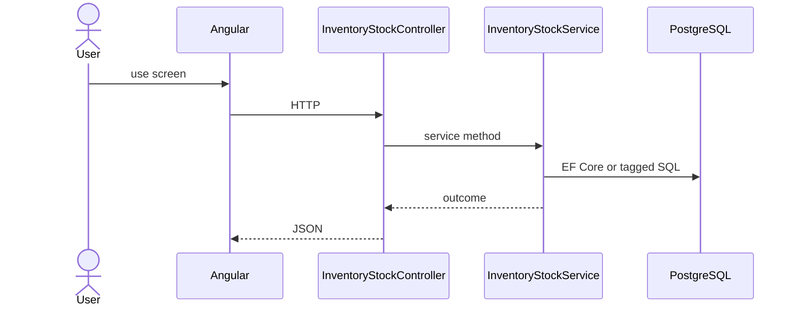

# Feature: Current Stock

```yaml
---
id: feat:inv-current-stock
module: inventory
category: transactions
status: verified
ui: inventory-stock-issue
api:
  - GET inventory-stocks/current-stock -> InventoryStockController.GetCurrentStock
service: InventoryStockService
repos: []
sql: []
tables: [inventory_stocks]
upstream: [feat:inv-batch, feat:inv-rack]
downstream: [feat:inv-stock-issue, feat:inv-stock-transfer, feat:inv-stock-adjustment]
---
```

## Purpose

Read current cumulative stock by batch/rack (helper API used by transaction screens; no dedicated menu page).

## Entry

| Kind | Value |
|------|-------|
| Menu / routes | `inventory-module/inventory-stock-issue` |
| Angular page | `retailr-client/src/app/modules/inventory-module/pages/inventory-stock-issue/` |
| API controller | `retailr-server/src/Modules/InventoryModule/InventoryModule.Api/Controllers/InventoryStockController.cs` |
| App service | `retailr-server/src/Modules/InventoryModule/InventoryModule.Application/Features/InventoryStockFeatures/` |

## Execution



## Code map

| Layer | Path |
|-------|------|
| Angular | `retailr-client/src/app/modules/inventory-module/pages/inventory-stock-issue/` |
| Controller | `retailr-server/src/Modules/InventoryModule/InventoryModule.Api/Controllers/InventoryStockController.cs` |
| Service | `retailr-server/src/Modules/InventoryModule/InventoryModule.Application/Features/InventoryStockFeatures/` |

## Notes

No dedicated Angular route; consumed from other inventory pages. `ui` points at a primary consumer.

## Tables

- `tbl:inventory_stocks`

## Gaps

UI consumer list not exhaustively audited beyond issue/transfer/adjustment patterns.
