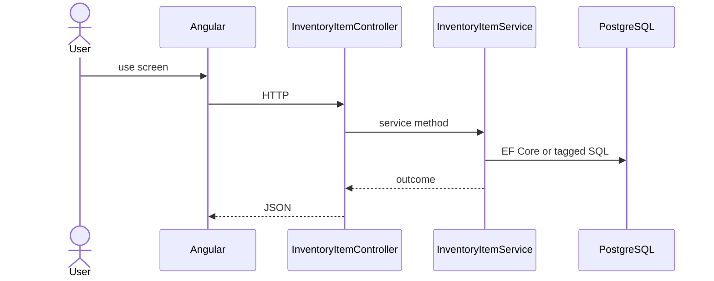

# Feature: Item

```yaml
---
id: feat:inv-item
module: inventory
category: master-data
status: verified
ui: inventory-item
api:
  - POST inventory-items -> InventoryItemController.Create
  - GET inventory-items -> InventoryItemController.GetAll
  - POST inventory-items/query -> InventoryItemController.GetAll
  - GET inventory-items/details -> InventoryItemController.GetDetailedAll
  - PUT inventory-items/{id} -> InventoryItemController.Update
  - GET inventory-items/attribute-data/{inventoryItemId} -> InventoryItemController.GetAllAttributeData
  - GET inventory-items/batches-with-stock-fifo -> InventoryItemController.GetBatchesWithStockByFifo
service: InventoryItemService
repos: []
sql: []
tables: [inventory_items, inventory_item_attributes, inventory_batches, inventory_stocks]
upstream: [feat:inv-material, feat:inv-attribute]
downstream: [feat:inv-batch, feat:inv-stock-opening, feat:inv-stock-issue]
---
```

## Purpose

SKU/item master under materials; attribute data; FIFO batches-with-stock helper for issue UI.

## Entry

| Kind | Value |
|------|-------|
| Menu / routes | `inventory-module/inventory-item` |
| Angular page | `retailr-client/src/app/modules/inventory-module/pages/inventory-item/` |
| API controller | `retailr-server/src/Modules/InventoryModule/InventoryModule.Api/Controllers/InventoryItemController.cs` |
| App service | `retailr-server/src/Modules/InventoryModule/InventoryModule.Application/Features/InventoryItemFeatures/` |

## Execution



## Code map

| Layer | Path |
|-------|------|
| Angular | `retailr-client/src/app/modules/inventory-module/pages/inventory-item/` |
| Controller | `retailr-server/src/Modules/InventoryModule/InventoryModule.Api/Controllers/InventoryItemController.cs` |
| Service | `retailr-server/src/Modules/InventoryModule/InventoryModule.Application/Features/InventoryItemFeatures/` |


## Tables

- `tbl:inventory_items`
- `tbl:inventory_item_attributes`
- `tbl:inventory_batches`
- `tbl:inventory_stocks`

## Gaps

Controller actions listed from source; stock side-effects inside action-flow verified at service level only where noted.
