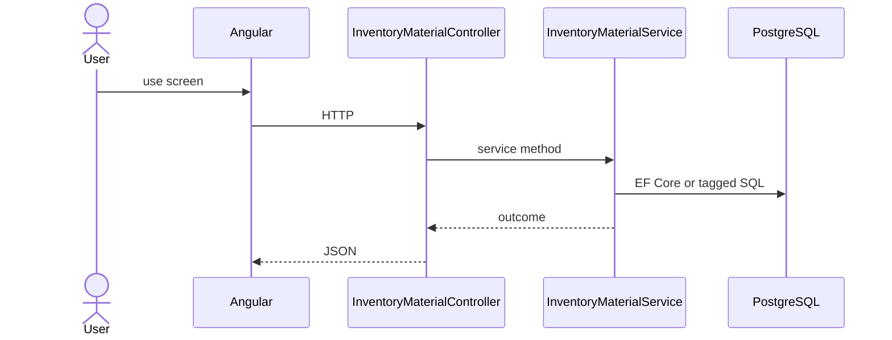

# Feature: Material

```yaml
---
id: feat:inv-material
module: inventory
category: master-data
status: verified
ui: inventory-material
api:
  - POST inventory-materials -> InventoryMaterialController.Create
  - GET inventory-materials -> InventoryMaterialController.GetAll
  - GET inventory-materials/details -> InventoryMaterialController.GetDetailedAll
  - GET inventory-materials/details/{id} -> InventoryMaterialController.GetDetailed
  - GET inventory-materials/details-slim -> InventoryMaterialController.GetDetailedSlim
  - POST inventory-materials/query -> InventoryMaterialController.GetAll
  - PUT inventory-materials/{id} -> InventoryMaterialController.Update
  - GET inventory-materials/attribute-data/{inventoryMaterialId} -> InventoryMaterialController.GetAllAttributeData
service: InventoryMaterialService
repos: [InventoryMaterialRepository]
sql: [InventoryMaterialQuery]
tables: [inventory_materials, inventory_material_categories]
upstream: [feat:inv-category, feat:inv-attribute]
downstream: [feat:inv-item, feat:inv-stock-opening, feat:inv-bp-rfq-setting]
---
```

## Purpose

Material master with category links, detail/slim lists, and attribute-data for UI.

## Entry

| Kind | Value |
|------|-------|
| Menu / routes | `inventory-module/inventory-material` |
| Angular page | `retailr-client/src/app/modules/inventory-module/pages/inventory-material/` |
| API controller | `retailr-server/src/Modules/InventoryModule/InventoryModule.Api/Controllers/InventoryMaterialController.cs` |
| App service | `retailr-server/src/Modules/InventoryModule/InventoryModule.Application/Features/InventoryMaterialFeatures/` |

## Execution



## Code map

| Layer | Path |
|-------|------|
| Angular | `retailr-client/src/app/modules/inventory-module/pages/inventory-material/` |
| Controller | `retailr-server/src/Modules/InventoryModule/InventoryModule.Api/Controllers/InventoryMaterialController.cs` |
| Service | `retailr-server/src/Modules/InventoryModule/InventoryModule.Application/Features/InventoryMaterialFeatures/` |

## Notes

May use PG function `inventory_module.inventory_material_query` (tag InventoryMaterialQuery).

## Tables

- `tbl:inventory_materials`
- `tbl:inventory_material_categories`

## Gaps

Controller actions listed from source; stock side-effects inside action-flow verified at service level only where noted.
