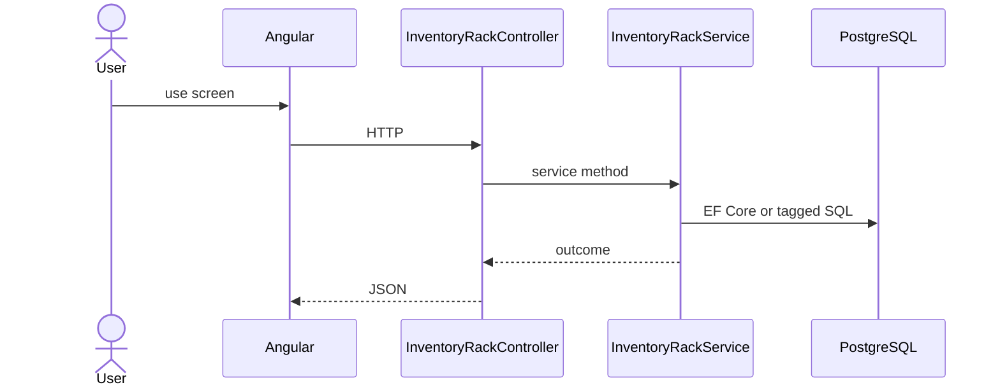

# Feature: Rack

```yaml
---
id: feat:inv-rack
module: inventory
category: master-data
status: verified
ui: inventory-rack
api:
  - POST inventory-racks -> InventoryRackController.Create
  - GET inventory-racks -> InventoryRackController.GetAll
  - POST inventory-racks/query -> InventoryRackController.GetAll
  - PUT inventory-racks/{id} -> InventoryRackController.Update
service: InventoryRackService
repos: []
sql: []
tables: [inventory_racks]
upstream: [feat:inv-store]
downstream: [feat:inv-stock-opening, feat:inv-stock-mrr-rm, feat:inv-stock-transfer]
---
```

## Purpose

Location/rack under a store.

## Entry

| Kind | Value |
|------|-------|
| Menu / routes | `inventory-module/inventory-rack` |
| Angular page | `retailr-client/src/app/modules/inventory-module/pages/inventory-rack/` |
| API controller | `retailr-server/src/Modules/InventoryModule/InventoryModule.Api/Controllers/InventoryRackController.cs` |
| App service | `retailr-server/src/Modules/InventoryModule/InventoryModule.Application/Features/InventoryRackFeatures/` |

## Execution



## Code map

| Layer | Path |
|-------|------|
| Angular | `retailr-client/src/app/modules/inventory-module/pages/inventory-rack/` |
| Controller | `retailr-server/src/Modules/InventoryModule/InventoryModule.Api/Controllers/InventoryRackController.cs` |
| Service | `retailr-server/src/Modules/InventoryModule/InventoryModule.Application/Features/InventoryRackFeatures/` |


## Tables

- `tbl:inventory_racks`

## Gaps

Controller actions listed from source; stock side-effects inside action-flow verified at service level only where noted.
