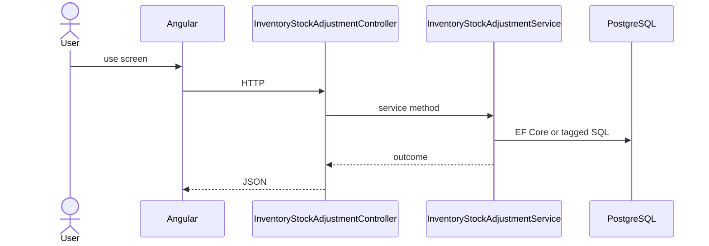

# Feature: Stock Adjustment

```yaml
---
id: feat:inv-stock-adjustment
module: inventory
category: transactions
status: verified
ui: inventory-stock-adjustment
api:
  - POST inventory-stock-adjustments -> InventoryStockAdjustmentController.Create
  - GET inventory-stock-adjustments -> InventoryStockAdjustmentController.GetAll
  - POST inventory-stock-adjustments/query -> InventoryStockAdjustmentController.GetAll
  - GET inventory-stock-adjustments/{id} -> InventoryStockAdjustmentController.GetById
  - PUT inventory-stock-adjustments/{id} -> InventoryStockAdjustmentController.Update
  - POST inventory-stock-adjustments/details -> InventoryStockAdjustmentController.CreateDetail
  - PUT inventory-stock-adjustments/details/{detailId} -> InventoryStockAdjustmentController.UpdateDetail
  - DELETE inventory-stock-adjustments/details/{detailId} -> InventoryStockAdjustmentController.DeleteDetail
  - GET inventory-stock-adjustments/details/{detailId} -> InventoryStockAdjustmentController.GetDetailById
  - GET inventory-stock-adjustments/details/by-adjustment/{adjustmentId} -> InventoryStockAdjustmentController.GetDetailsByAdjustmentId
  - POST inventory-stock-adjustments/action-flow -> InventoryStockAdjustmentController.UpdateActionFlow
service: InventoryStockAdjustmentService
repos: []
sql: []
tables: [inventory_stock_adjustments, inventory_stock_adjustment_details, inventory_stock_adjustments_action_flows, inventory_stocks]
upstream: [feat:inv-store, feat:inv-batch, feat:inv-rack]
downstream: [feat:inv-stock-report]
---
```

## Purpose

Adjust stock quantities via header/details and workflow action-flow.

## Entry

| Kind | Value |
|------|-------|
| Menu / routes | `inventory-module/inventory-stock-adjustment` |
| Angular page | `retailr-client/src/app/modules/inventory-module/pages/inventory-stock-adjustment/` |
| API controller | `retailr-server/src/Modules/InventoryModule/InventoryModule.Api/Controllers/InventoryStockAdjustmentController.cs` |
| App service | `retailr-server/src/Modules/InventoryModule/InventoryModule.Application/Features/InventoryStockAdjustmentFeatures/` |

## Execution



## Code map

| Layer | Path |
|-------|------|
| Angular | `retailr-client/src/app/modules/inventory-module/pages/inventory-stock-adjustment/` |
| Controller | `retailr-server/src/Modules/InventoryModule/InventoryModule.Api/Controllers/InventoryStockAdjustmentController.cs` |
| Service | `retailr-server/src/Modules/InventoryModule/InventoryModule.Application/Features/InventoryStockAdjustmentFeatures/` |


## Tables

- `tbl:inventory_stock_adjustments`
- `tbl:inventory_stock_adjustment_details`
- `tbl:inventory_stock_adjustments_action_flows`
- `tbl:inventory_stocks`

## Gaps

Controller actions listed from source; stock side-effects inside action-flow verified at service level only where noted.
