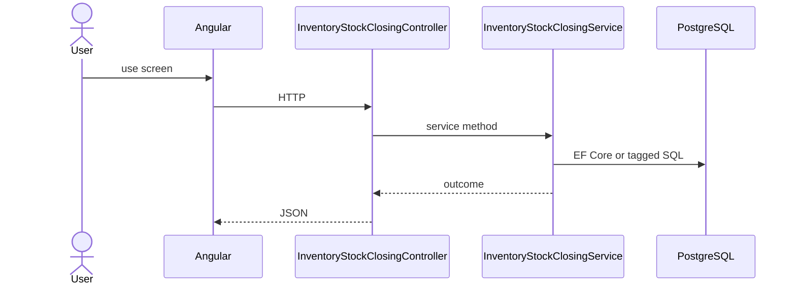

# Feature: Stock Closing

```yaml
---
id: feat:inv-stock-closing
module: inventory
category: transactions
status: verified
ui: inventory-stock-closing
api:
  - POST inventory-stock-closings -> InventoryStockClosingController.ProcessStockClosing
service: InventoryStockClosingService
repos: []
sql: []
tables: [inventory_stock_closings, inventory_stocks]
upstream: [feat:inv-stock-opening, feat:inv-store, feat:inv-current-stock]
downstream: [feat:inv-stock-report]
---
```

## Purpose

Period stock closing process. UI also reads current stocks via report APIs before posting close.

## Entry

| Kind | Value |
|------|-------|
| Menu / routes | `inventory-module/inventory-stock-closing` |
| Angular page | `retailr-client/src/app/modules/inventory-module/pages/inventory-stock-closing/` |
| API controller | `retailr-server/src/Modules/InventoryModule/InventoryModule.Api/Controllers/InventoryStockClosingController.cs` |
| App service | `retailr-server/src/Modules/InventoryModule/InventoryModule.Application/Features/InventoryStockClosingFeatures/` |

## Execution



## Code map

| Layer | Path |
|-------|------|
| Angular | `retailr-client/src/app/modules/inventory-module/pages/inventory-stock-closing/` |
| Controller | `retailr-server/src/Modules/InventoryModule/InventoryModule.Api/Controllers/InventoryStockClosingController.cs` |
| Service | `retailr-server/src/Modules/InventoryModule/InventoryModule.Application/Features/InventoryStockClosingFeatures/` |

## Notes

Client may call `GET inventory-reports/stocks` while preparing close (owned by `feat:inv-stock-report`).

## Tables

- `tbl:inventory_stock_closings`
- `tbl:inventory_stocks`

## Gaps

Controller actions listed from source; stock side-effects inside action-flow verified at service level only where noted.
