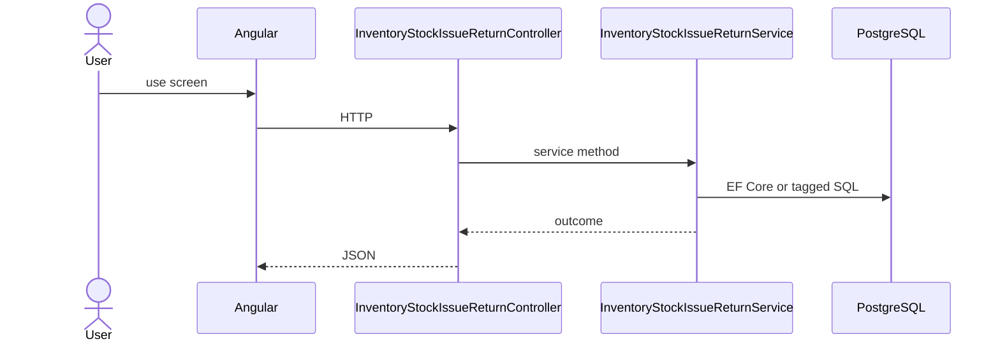

# Feature: Stock Issue Return

```yaml
---
id: feat:inv-stock-issue-return
module: inventory
category: transactions
status: verified
ui: inventory-stock-issue-return
api:
  - POST inventory-stock-issue-returns -> InventoryStockIssueReturnController.Create
  - GET inventory-stock-issue-returns -> InventoryStockIssueReturnController.GetAll
  - POST inventory-stock-issue-returns/query -> InventoryStockIssueReturnController.GetAll
  - GET inventory-stock-issue-returns/{id} -> InventoryStockIssueReturnController.GetById
  - PUT inventory-stock-issue-returns/{id} -> InventoryStockIssueReturnController.Update
  - POST inventory-stock-issue-returns/action-flow -> InventoryStockIssueReturnController.UpdateActionFlow
service: InventoryStockIssueReturnService
repos: []
sql: []
tables: [inventory_stock_issue_returns, inventory_stock_issue_return_details, inventory_stock_issue_return_action_flows, inventory_stocks]
upstream: [feat:inv-stock-issue]
downstream: [feat:inv-stock-report]
---
```

## Purpose

Return previously issued stock; header CRUD + action-flow.

## Entry

| Kind | Value |
|------|-------|
| Menu / routes | `inventory-module/inventory-stock-issue-return` |
| Angular page | `retailr-client/src/app/modules/inventory-module/pages/inventory-stock-issue-return/` |
| API controller | `retailr-server/src/Modules/InventoryModule/InventoryModule.Api/Controllers/InventoryStockIssueReturnController.cs` |
| App service | `retailr-server/src/Modules/InventoryModule/InventoryModule.Application/Features/InventoryStockIssueReturnFeatures/` |

## Execution



## Code map

| Layer | Path |
|-------|------|
| Angular | `retailr-client/src/app/modules/inventory-module/pages/inventory-stock-issue-return/` |
| Controller | `retailr-server/src/Modules/InventoryModule/InventoryModule.Api/Controllers/InventoryStockIssueReturnController.cs` |
| Service | `retailr-server/src/Modules/InventoryModule/InventoryModule.Application/Features/InventoryStockIssueReturnFeatures/` |


## Tables

- `tbl:inventory_stock_issue_returns`
- `tbl:inventory_stock_issue_return_details`
- `tbl:inventory_stock_issue_return_action_flows`
- `tbl:inventory_stocks`

## Gaps

Controller actions listed from source; stock side-effects inside action-flow verified at service level only where noted.
