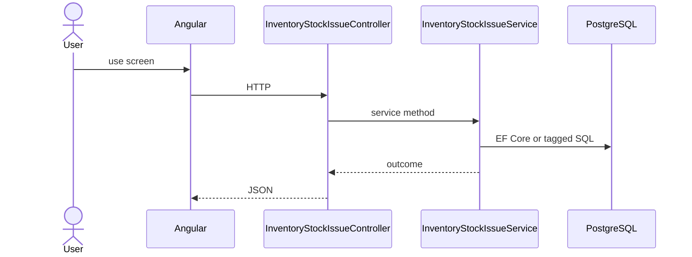

# Feature: Stock Issue

```yaml
---
id: feat:inv-stock-issue
module: inventory
category: transactions
status: verified
ui: inventory-stock-issue
api:
  - POST inventory-stock-issues -> InventoryStockIssueController.Create
  - GET inventory-stock-issues -> InventoryStockIssueController.GetAll
  - GET inventory-stock-issues/query -> InventoryStockIssueController.GetAll
  - GET inventory-stock-issues/{id} -> InventoryStockIssueController.GetById
  - PUT inventory-stock-issues/{id} -> InventoryStockIssueController.Update
  - POST inventory-stock-issues/details -> InventoryStockIssueController.CreateDetail
  - PUT inventory-stock-issues/details/{detailId} -> InventoryStockIssueController.UpdateDetail
  - DELETE inventory-stock-issues/details/{detailId} -> InventoryStockIssueController.DeleteDetail
  - GET inventory-stock-issues/details/{detailId} -> InventoryStockIssueController.GetDetailById
  - GET inventory-stock-issues/details/by-issue/{issueId} -> InventoryStockIssueController.GetDetailsByIssueId
  - POST inventory-stock-issues/action-flow -> InventoryStockIssueController.UpdateActionFlow
  - GET inventory-stock-issues/details/requisition-with-issue -> InventoryStockIssueController.GetRequisitionDetailsWithIssued
  - POST inventory-stock-issues/details/bulk-create-update -> InventoryStockIssueController.BulkCreateOrUpdateDetails
  - GET inventory-stock-issues/report/{issueId} -> InventoryStockIssueController.GetReport
service: InventoryStockIssueService
repos: [InventoryStockIssueRepository]
sql: [InventoryStockIssueQuery, StockIssueDetailWithRequisitionQuery]
tables: [inventory_stock_issues, inventory_stock_issue_details, inventory_stock_issue_action_flows, inventory_stocks]
upstream: [feat:inv-stock-requisition, feat:inv-item, feat:inv-store]
downstream: [feat:inv-stock-issue-return, feat:inv-stock-report]
---
```

## Purpose

Issue stock (often against a requisition); details, bulk create/update, action-flow, report. Updates cumulative stock on completion.

## Entry

| Kind | Value |
|------|-------|
| Menu / routes | `inventory-module/inventory-stock-issue`, `inventory-module/inventory-stock-issue-report/:issueId` |
| Angular page | `retailr-client/src/app/modules/inventory-module/pages/inventory-stock-issue/` |
| API controller | `retailr-server/src/Modules/InventoryModule/InventoryModule.Api/Controllers/InventoryStockIssueController.cs` |
| App service | `retailr-server/src/Modules/InventoryModule/InventoryModule.Application/Features/InventoryStockIssueFeatures/` |

## Execution



## Code map

| Layer | Path |
|-------|------|
| Angular | `retailr-client/src/app/modules/inventory-module/pages/inventory-stock-issue/` |
| Controller | `retailr-server/src/Modules/InventoryModule/InventoryModule.Api/Controllers/InventoryStockIssueController.cs` |
| Service | `retailr-server/src/Modules/InventoryModule/InventoryModule.Application/Features/InventoryStockIssueFeatures/` |

## Notes

Query endpoint is **GET** `inventory-stock-issues/query` (not POST).

## Tables

- `tbl:inventory_stock_issues`
- `tbl:inventory_stock_issue_details`
- `tbl:inventory_stock_issue_action_flows`
- `tbl:inventory_stocks`

## Gaps

Controller actions listed from source; stock side-effects inside action-flow verified at service level only where noted.
