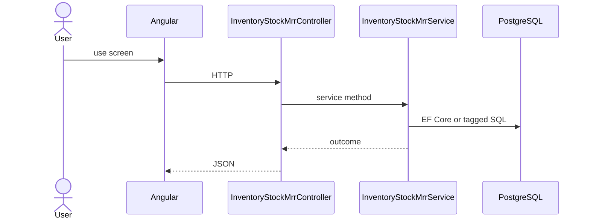

# Feature: Stock MRR (Finish Good)

```yaml
---
id: feat:inv-stock-mrr-fg
module: inventory
category: transactions
status: verified
ui: inventory-stock-mrr-fg
api:
  - POST inventory-stock-mrrs -> InventoryStockMrrController.Create
  - GET inventory-stock-mrrs -> InventoryStockMrrController.GetAll
  - POST inventory-stock-mrrs/query -> InventoryStockMrrController.GetAll
  - GET inventory-stock-mrrs/{id} -> InventoryStockMrrController.GetById
  - PUT inventory-stock-mrrs/{id} -> InventoryStockMrrController.Update
  - POST inventory-stock-mrrs/details -> InventoryStockMrrController.CreateDetail
  - PUT inventory-stock-mrrs/details/{detailId} -> InventoryStockMrrController.UpdateDetail
  - PUT inventory-stock-mrrs/details/bulk -> InventoryStockMrrController.BulkUpdateDetail
  - DELETE inventory-stock-mrrs/details/{detailId} -> InventoryStockMrrController.DeleteDetail
  - GET inventory-stock-mrrs/details/{detailId} -> InventoryStockMrrController.GetDetailById
  - GET inventory-stock-mrrs/details/by-mrr/{mrrStockId} -> InventoryStockMrrController.GetDetailsByMrrId
  - POST inventory-stock-mrrs/action-flow -> InventoryStockMrrController.UpdateActionFlow
  - GET inventory-stock-mrrs/report/{mrrId} -> InventoryStockMrrController.GetReport
  - PUT inventory-stock-mrrs/costing -> InventoryStockMrrController.UpdateCosting
service: InventoryStockMrrService
repos: [InventoryStockMrrRepository, InventoryStockMrrDetailRepository, InventoryStockRepository]
sql: []
tables: [inventory_stock_mrrs, inventory_stock_mrr_details, inventory_stock_mrr_action_flows, inventory_stocks]
upstream: [feat:inv-store, feat:inv-item, feat:inv-rack, feat:inv-batch]
downstream: [feat:inv-stock-report]
---
```

## Purpose

Material Receipt for finish goods (`MrrCategory = FG`). Shares the same API controller as RM; UI and FG permissions differ.

## Entry

| Kind | Value |
|------|-------|
| Menu / routes | `inventory-module/inventory-stock-mrr-fg` |
| Angular page | `retailr-client/src/app/modules/inventory-module/pages/inventory-stock-mrr-fg/` |
| API controller | `retailr-server/src/Modules/InventoryModule/InventoryModule.Api/Controllers/InventoryStockMrrController.cs` |
| App service | `retailr-server/src/Modules/InventoryModule/InventoryModule.Application/Features/InventoryStockMrrFeatures/` |

## Execution



## Code map

| Layer | Path |
|-------|------|
| Angular | `retailr-client/src/app/modules/inventory-module/pages/inventory-stock-mrr-fg/` |
| Controller | `retailr-server/src/Modules/InventoryModule/InventoryModule.Api/Controllers/InventoryStockMrrController.cs` |
| Service | `retailr-server/src/Modules/InventoryModule/InventoryModule.Application/Features/InventoryStockMrrFeatures/` |

## Notes

Sibling of `feat:inv-stock-mrr-rm`. Permissions: `InventoryStockMrrFg.*`.

## Tables

- `tbl:inventory_stock_mrrs`
- `tbl:inventory_stock_mrr_details`
- `tbl:inventory_stock_mrr_action_flows`
- `tbl:inventory_stocks`

## Gaps

Controller actions listed from source; stock side-effects inside action-flow verified at service level only where noted.
