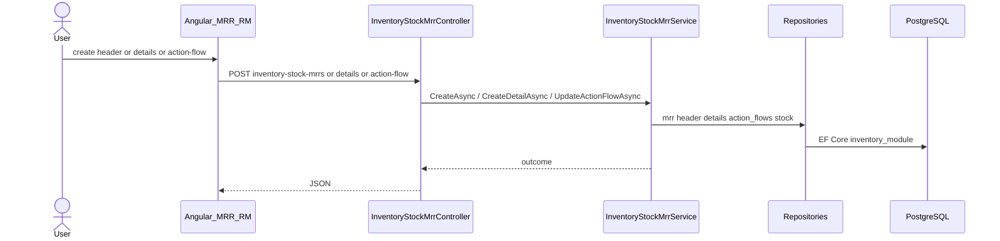

# Feature: Stock MRR (Raw Material)

```yaml
---
id: feat:inv-stock-mrr-rm
module: inventory
category: transactions
status: verified
ui: inventory-stock-mrr
api:
  - POST inventory-stock-mrrs -> InventoryStockMrrController.Create
  - GET inventory-stock-mrrs -> InventoryStockMrrController.GetAll
  - POST inventory-stock-mrrs/query -> InventoryStockMrrController.GetAll
  - GET inventory-stock-mrrs/{id} -> InventoryStockMrrController.GetById
  - PUT inventory-stock-mrrs/{id} -> InventoryStockMrrController.Update
  - POST inventory-stock-mrrs/details -> InventoryStockMrrController.CreateDetail
  - PUT inventory-stock-mrrs/details/{detailId} -> InventoryStockMrrController.UpdateDetail
  - PUT inventory-stock-mrrs/details/bulk -> InventoryStockMrrController.BulkUpdateDetail
  - DELETE inventory-stock-mrrs/details/{detailId} -> InventoryStockMrrController.DeleteDetail
  - GET inventory-stock-mrrs/details/{detailId} -> InventoryStockMrrController.GetDetailById
  - GET inventory-stock-mrrs/details/by-mrr/{mrrStockId} -> InventoryStockMrrController.GetDetailsByMrrId
  - POST inventory-stock-mrrs/action-flow -> InventoryStockMrrController.UpdateActionFlow
  - GET inventory-stock-mrrs/report/{mrrId} -> InventoryStockMrrController.GetReport
  - PUT inventory-stock-mrrs/costing -> InventoryStockMrrController.UpdateCosting
service: InventoryStockMrrService
repos: [InventoryStockMrrRepository, InventoryStockMrrDetailRepository, InventoryStockRepository]
sql: []
tables: [inventory_stock_mrrs, inventory_stock_mrr_details, inventory_stock_mrr_action_flows, inventory_stocks, inventory_batches, inventory_racks, inventory_stores]
upstream: [feat:inv-store, feat:inv-rack, feat:inv-batch, feat:inv-material, feat:inv-item]
downstream: [feat:inv-stock-report, feat:inv-stock-issue, feat:inv-stock-mrr-fg]
---
```

## Purpose

Material Receipt (MRR) for **raw material** (`MrrCategory = RM`). Header + line details, workflow action-flow, QC report, and costing. Completing workflow updates cumulative `inventory_stocks` (received quantities). Same API controller serves FG MRR (`feat:inv-stock-mrr-fg`) with FG permissions/UI.

## Entry

| Kind | Value |
|------|-------|
| Menu route | `inventory-module/inventory-stock-mrr-rm` |
| Angular page | `retailr-client/src/app/modules/inventory-module/pages/inventory-stock-mrr/` |
| Client API keys | `INVENTORY_MODULE.INVENTORY_STOCK_MRR.*` |
| API base | `inventory-stock-mrrs/` |

## Execution



```
mod:inventory
   │
   └──CONTAINS──► feat:inv-stock-mrr-rm
                       │
                       ├──USES_SERVICE──► svc:InventoryStockMrrService
                       ├──EXPOSES──► ui:inventory-stock-mrr
                       ├──EXPOSES──► api:POST:inventory-stock-mrrs
                       ├──EXPOSES──► api:POST:inventory-stock-mrrs/action-flow
                       ├──EXPOSES──► api:PUT:inventory-stock-mrrs/costing
                       │
                       └──USES_TABLE──► tbl:inventory_stock_mrrs
                                        tbl:inventory_stock_mrr_details
                                        tbl:inventory_stocks

col:inventory_stock_mrr_details.inventory_stock_mrr_id ──FK_TO──► col:inventory_stock_mrrs.id
col:inventory_stock_mrr_details.inventory_batch_id     ──FK_TO──► col:inventory_batches.id
col:inventory_stock_mrr_details.inventory_rack_id      ──FK_TO──► col:inventory_racks.id
```

## Code map

| Layer | Path |
|-------|------|
| Angular RM | `retailr-client/.../pages/inventory-stock-mrr/` |
| Angular FG (sibling) | `retailr-client/.../pages/inventory-stock-mrr-fg/` |
| API | `.../Controllers/InventoryStockMrrController.cs` |
| Service | `.../Features/InventoryStockMrrFeatures/` |
| Entities | `InventoryStockMrr`, `InventoryStockMrrDetail`, action-flow entity |

## SQL

EF Core primary path. Stock report aggregation (separate feature) uses tagged SQL `InventoryStockReportQuery` that reads MRR detail movements when workflow complete.

## Tables / columns

- [inventory_stock_mrrs.md](../schema/inventory_stock_mrrs.md)
- [inventory_stock_mrr_details.md](../schema/inventory_stock_mrr_details.md)
- [inventory_stocks.md](../schema/inventory_stocks.md)

## Permissions

`InventoryModulePermission.InventoryStockMrr.*` (RM). FG uses `InventoryStockMrrFg.*` on same controller via `RequireAnyPermission`.

## Dependencies

- Upstream: store, rack, batch/item/material, business profile, lookups (`lk_mrr_types`, `lk_mrr_receive_types`).
- Downstream: stock report, issues; FG is sibling UI on same APIs (`feat:inv-stock-mrr-fg`).

## Gaps

- Exact stock-update timing inside action-flow completion not line-by-line audited in this doc (verify in `InventoryStockMrrService.UpdateActionFlowAsync` when debugging).
- Base MRR / exchange detail paths inferred from entity fields.
