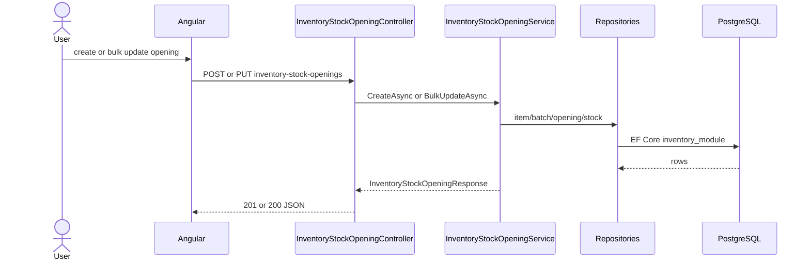

# Feature: Stock Opening

```yaml
---
id: feat:inv-stock-opening
module: inventory
category: transactions
status: verified
ui: inventory-stock-opening
api:
  - POST inventory-stock-openings -> InventoryStockOpeningController.Create
  - PUT inventory-stock-openings -> InventoryStockOpeningController.Update
  - PUT inventory-stock-openings/bulk -> InventoryStockOpeningController.BulkUpdate
  - GET inventory-stock-openings -> InventoryStockOpeningController.GetOne
  - POST inventory-stock-openings/query -> InventoryStockOpeningController.GetAll
  - GET inventory-stock-openings/report -> InventoryStockOpeningController.GetReport
service: InventoryStockOpeningService
repos: [InventoryStockOpeningRepository, InventoryStockRepository, InventoryItemRepository, InventoryBatchRepository, InventoryMaterialRepository]
sql: []
tables: [inventory_stock_openings, inventory_stocks, inventory_batches, inventory_racks, inventory_items, inventory_materials]
upstream: [feat:inv-store, feat:inv-rack, feat:inv-item, feat:inv-batch, feat:inv-material]
downstream: [feat:inv-stock-report, feat:inv-stock-closing]
---
```

## Purpose

User records opening stock balances per batch + rack + effective date. Create may also create item/batch when opening a new SKU. Update / bulk update can lock the opening and write/adjust the cumulative `inventory_stocks` row (`ReceivedQuantity`).

## Entry

| Kind | Value |
|------|-------|
| Menu route | `inventory-module/inventory-stock-opening` (+ report: `inventory-stock-opening-report`) |
| Angular page | `retailr-client/src/app/modules/inventory-module/pages/inventory-stock-opening/` |
| Client service | `inventory-stock-opening.service.ts` |
| API base | `inventory-stock-openings/` |

## Execution



```
mod:inventory
   │
   └──CONTAINS──► feat:inv-stock-opening
                       │
                       ├──USES_SERVICE──► svc:InventoryStockOpeningService
                       ├──EXPOSES──► ui:inventory-stock-opening
                       ├──EXPOSES──► api:POST:inventory-stock-openings
                       ├──EXPOSES──► api:PUT:inventory-stock-openings/bulk
                       ├──EXPOSES──► api:GET:inventory-stock-openings/report
                       │
                       └──USES_TABLE──► tbl:inventory_stock_openings
                                        tbl:inventory_stocks
                                        tbl:inventory_batches
                                        tbl:inventory_racks

col:inventory_stock_openings.inventory_batch_id ──FK_TO──► col:inventory_batches.id
col:inventory_stock_openings.inventory_rack_id   ──FK_TO──► col:inventory_racks.id
```

## Code map

| Layer | Type | Path |
|-------|------|------|
| Angular | page | `retailr-client/src/app/modules/inventory-module/pages/inventory-stock-opening/inventory-stock-opening.component.ts` |
| Angular | service | `.../inventory-stock-opening.service.ts` |
| API | controller | `retailr-server/src/Modules/InventoryModule/InventoryModule.Api/Controllers/InventoryStockOpeningController.cs` |
| Service | app | `.../Application/Features/InventoryStockOpeningFeatures/InventoryStockOpeningService.cs` |
| Repository | opening | `.../Persistence/Repositories/InventoryStockOpeningRepository.cs` |
| Entity | opening | `.../Domain/Entities/InventoryStockOpening.cs` |
| Entity | stock | `.../Domain/Entities/InventoryStock.cs` |
| EF config | opening | `.../EntityConfigs/InventoryStockOpeningConfig.cs` |

## SQL

No dedicated PG function / tagged query for this feature. Persistence is EF Core against `inventory_module` tables.

## Tables / columns

- [inventory_stock_openings.md](../schema/inventory_stock_openings.md)
- [inventory_stocks.md](../schema/inventory_stocks.md)

Composite PK opening: `(inventory_batch_id, inventory_rack_id, effective_date)`.

On update when `IsDataLocked` becomes true, service upserts `inventory_stocks` and adds quantity into `ReceivedQuantity`.

## Permissions

`InventoryModulePermission.InventoryStockOpening.{Create,Update,Read}`

## Dependencies

- Upstream: store/rack/item/batch/material masters (create path can create item + batch).
- Downstream: stock report reads openings; closing depends on period stock state.

## Gaps

- Client `create` / `bulkUpdate` verified; list/query/report UI paths inferred from routes + controller.
- Exact menu labels not captured (side-menu collection).
