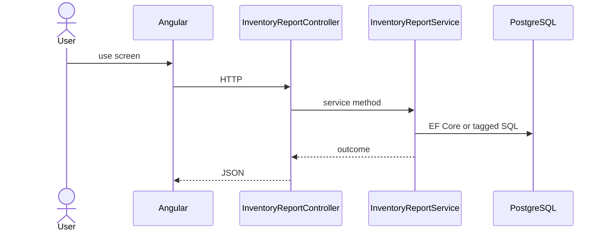

# Feature: Stock Report

```yaml
---
id: feat:inv-stock-report
module: inventory
category: reports
status: verified
ui: inventory-stock-report
api:
  - GET inventory-reports/stocks -> InventoryReportController.GetStockReport
  - GET inventory-reports/report-header -> InventoryReportController.GetReportHeader
service: InventoryReportService
repos: [InventoryReportRepository]
sql: [InventoryStockReportQuery]
tables: [inventory_stocks, inventory_stock_openings, inventory_stock_mrr_details, inventory_stock_issue_details, inventory_stock_transfer_details, inventory_stock_adjustment_details]
upstream: [feat:inv-stock-opening, feat:inv-stock-mrr-rm, feat:inv-stock-issue, feat:inv-stock-transfer, feat:inv-stock-adjustment]
downstream: []
---
```

## Purpose

Period stock movement report (opening, receipts, issues, transfers, adjustments, closing).

## Entry

| Kind | Value |
|------|-------|
| Menu / routes | `inventory-module/inventory-stock-report`, `inventory-module/inventory-stock-report-printing` |
| Angular page | `retailr-client/src/app/modules/inventory-module/pages/inventory-stock-report/` |
| API controller | `retailr-server/src/Modules/InventoryModule/InventoryModule.Api/Controllers/InventoryReportController.cs` |
| App service | `retailr-server/src/Modules/InventoryModule/InventoryModule.Application/Features/InventoryReportFeatures/` |

## Execution



## Code map

| Layer | Path |
|-------|------|
| Angular | `retailr-client/src/app/modules/inventory-module/pages/inventory-stock-report/` |
| Controller | `retailr-server/src/Modules/InventoryModule/InventoryModule.Api/Controllers/InventoryReportController.cs` |
| Service | `retailr-server/src/Modules/InventoryModule/InventoryModule.Application/Features/InventoryReportFeatures/` |

## Notes

Deep SQL: `retailr-server/src/Modules/InventoryModule/InventoryModule.Infrastructure/Persistence/Docs/inventory-stock-report.md`.

## Tables

- `tbl:inventory_stocks`
- `tbl:inventory_stock_openings`
- `tbl:inventory_stock_mrr_details`
- `tbl:inventory_stock_issue_details`
- `tbl:inventory_stock_transfer_details`
- `tbl:inventory_stock_adjustment_details`

## Gaps

Controller actions listed from source; stock side-effects inside action-flow verified at service level only where noted.
