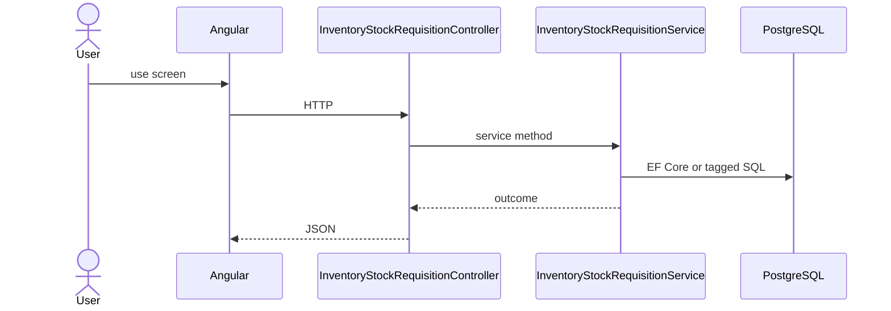

# Feature: Stock Requisition

```yaml
---
id: feat:inv-stock-requisition
module: inventory
category: transactions
status: verified
ui: inventory-stock-requisition
api:
  - POST inventory-stock-requisitions -> InventoryStockRequisitionController.Create
  - GET inventory-stock-requisitions -> InventoryStockRequisitionController.GetAll
  - POST inventory-stock-requisitions/query -> InventoryStockRequisitionController.GetAll
  - GET inventory-stock-requisitions/{id} -> InventoryStockRequisitionController.GetById
  - PUT inventory-stock-requisitions/{id} -> InventoryStockRequisitionController.Update
  - POST inventory-stock-requisitions/details -> InventoryStockRequisitionController.CreateDetail
  - POST inventory-stock-requisitions/details/bulk -> InventoryStockRequisitionController.CreateDetails
  - PUT inventory-stock-requisitions/details/{detailId} -> InventoryStockRequisitionController.UpdateDetail
  - DELETE inventory-stock-requisitions/details/{detailId} -> InventoryStockRequisitionController.DeleteDetail
  - GET inventory-stock-requisitions/details/{detailId} -> InventoryStockRequisitionController.GetDetailById
  - GET inventory-stock-requisitions/details/by-requisition/{requisitionId} -> InventoryStockRequisitionController.GetDetailsByRequisitionId
  - GET inventory-stock-requisitions/report/{requisitionId} -> InventoryStockRequisitionController.GetReport
  - POST inventory-stock-requisitions/action-flow -> InventoryStockRequisitionController.UpdateActionFlow
service: InventoryStockRequisitionService
repos: []
sql: []
tables: [inventory_stock_requisitions, inventory_stock_requisition_details, inventory_stock_requisition_action_flows]
upstream: [feat:inv-store, feat:inv-material, feat:inv-item]
downstream: [feat:inv-stock-issue]
---
```

## Purpose

Request stock between stores/racks; header + details + action-flow + print report.

## Entry

| Kind | Value |
|------|-------|
| Menu / routes | `inventory-module/inventory-stock-requisition`, `inventory-module/inventory-stock-requisition-report/:requisitionId` |
| Angular page | `retailr-client/src/app/modules/inventory-module/pages/inventory-stock-requisition/` |
| API controller | `retailr-server/src/Modules/InventoryModule/InventoryModule.Api/Controllers/InventoryStockRequisitionController.cs` |
| App service | `retailr-server/src/Modules/InventoryModule/InventoryModule.Application/Features/InventoryStockRequisitionFeatures/` |

## Execution



## Code map

| Layer | Path |
|-------|------|
| Angular | `retailr-client/src/app/modules/inventory-module/pages/inventory-stock-requisition/` |
| Controller | `retailr-server/src/Modules/InventoryModule/InventoryModule.Api/Controllers/InventoryStockRequisitionController.cs` |
| Service | `retailr-server/src/Modules/InventoryModule/InventoryModule.Application/Features/InventoryStockRequisitionFeatures/` |


## Tables

- `tbl:inventory_stock_requisitions`
- `tbl:inventory_stock_requisition_details`
- `tbl:inventory_stock_requisition_action_flows`

## Gaps

Controller actions listed from source; stock side-effects inside action-flow verified at service level only where noted.
