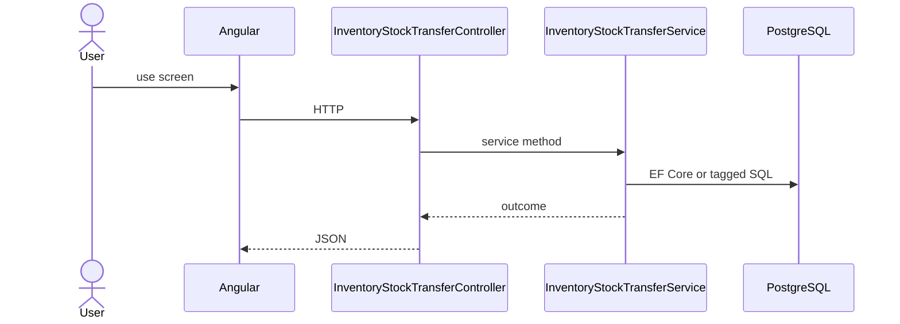

# Feature: Stock Transfer

```yaml
---
id: feat:inv-stock-transfer
module: inventory
category: transactions
status: verified
ui: inventory-stock-transfer
api:
  - POST inventory-stock-transfers -> InventoryStockTransferController.Create
  - GET inventory-stock-transfers -> InventoryStockTransferController.GetAll
  - POST inventory-stock-transfers/query -> InventoryStockTransferController.GetAll
  - GET inventory-stock-transfers/{id} -> InventoryStockTransferController.GetById
  - PUT inventory-stock-transfers/{id} -> InventoryStockTransferController.Update
  - POST inventory-stock-transfers/details -> InventoryStockTransferController.CreateDetail
  - PUT inventory-stock-transfers/details/{detailId} -> InventoryStockTransferController.UpdateDetail
  - PUT inventory-stock-transfers/bulk -> InventoryStockTransferController.BulkUpdateDetails
  - DELETE inventory-stock-transfers/details/{detailId} -> InventoryStockTransferController.DeleteDetail
  - GET inventory-stock-transfers/details/{detailId} -> InventoryStockTransferController.GetDetailById
  - GET inventory-stock-transfers/details/by-transfer/{transferId} -> InventoryStockTransferController.GetDetailsByTransferId
  - GET inventory-stock-transfers/report/{transferId} -> InventoryStockTransferController.GetReportDetailsByTransferId
  - POST inventory-stock-transfers/action-flow -> InventoryStockTransferController.UpdateActionFlow
service: InventoryStockTransferService
repos: []
sql: []
tables: [inventory_stock_transfers, inventory_stock_transfer_details, inventory_stock_transfer_action_flows, inventory_stocks]
upstream: [feat:inv-store, feat:inv-rack, feat:inv-batch]
downstream: [feat:inv-stock-report]
---
```

## Purpose

Transfer stock between stores/racks; details, bulk update, action-flow, report.

## Entry

| Kind | Value |
|------|-------|
| Menu / routes | `inventory-module/inventory-stock-transfer`, `inventory-module/inventory-stock-transfer-report/:transferId` |
| Angular page | `retailr-client/src/app/modules/inventory-module/pages/inventory-stock-transfer/` |
| API controller | `retailr-server/src/Modules/InventoryModule/InventoryModule.Api/Controllers/InventoryStockTransferController.cs` |
| App service | `retailr-server/src/Modules/InventoryModule/InventoryModule.Application/Features/InventoryStockTransferFeatures/` |

## Execution



## Code map

| Layer | Path |
|-------|------|
| Angular | `retailr-client/src/app/modules/inventory-module/pages/inventory-stock-transfer/` |
| Controller | `retailr-server/src/Modules/InventoryModule/InventoryModule.Api/Controllers/InventoryStockTransferController.cs` |
| Service | `retailr-server/src/Modules/InventoryModule/InventoryModule.Application/Features/InventoryStockTransferFeatures/` |


## Tables

- `tbl:inventory_stock_transfers`
- `tbl:inventory_stock_transfer_details`
- `tbl:inventory_stock_transfer_action_flows`
- `tbl:inventory_stocks`

## Gaps

Controller actions listed from source; stock side-effects inside action-flow verified at service level only where noted.
