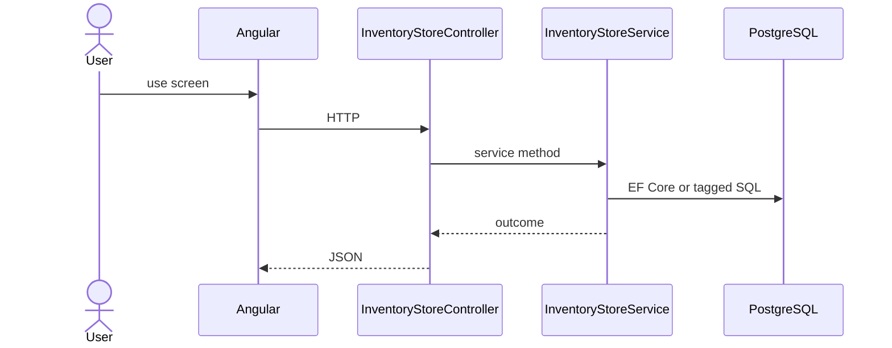

# Feature: Store

```yaml
---
id: feat:inv-store
module: inventory
category: master-data
status: verified
ui: inventory-store
api:
  - POST inventory-stores -> InventoryStoreController.Create
  - GET inventory-stores -> InventoryStoreController.GetAll
  - GET inventory-stores/paginated-details -> InventoryStoreController.GetAll
  - PUT inventory-stores/{id} -> InventoryStoreController.Update
  - GET inventory-stores/stores -> InventoryStoreController.GetStoresForDropdown
service: InventoryStoreService
repos: [InventoryStoreRepository]
sql: [InventoryStoreQuery]
tables: [inventory_stores, inventory_store_categories, inventory_store_users]
upstream: []
downstream: [feat:inv-rack, feat:inv-stock-opening, feat:inv-stock-mrr-rm, feat:inv-stock-requisition]
---
```

## Purpose

Warehouse/store master with users/categories mapping; slim dropdown list for other screens.

## Entry

| Kind | Value |
|------|-------|
| Menu / routes | `inventory-module/inventory-store` |
| Angular page | `retailr-client/src/app/modules/inventory-module/pages/inventory-store/` |
| API controller | `retailr-server/src/Modules/InventoryModule/InventoryModule.Api/Controllers/InventoryStoreController.cs` |
| App service | `retailr-server/src/Modules/InventoryModule/InventoryModule.Application/Features/InventoryStoreFeatures/` |

## Execution



## Code map

| Layer | Path |
|-------|------|
| Angular | `retailr-client/src/app/modules/inventory-module/pages/inventory-store/` |
| Controller | `retailr-server/src/Modules/InventoryModule/InventoryModule.Api/Controllers/InventoryStoreController.cs` |
| Service | `retailr-server/src/Modules/InventoryModule/InventoryModule.Application/Features/InventoryStoreFeatures/` |


## Tables

- `tbl:inventory_stores`
- `tbl:inventory_store_categories`
- `tbl:inventory_store_users`

## Gaps

Controller actions listed from source; stock side-effects inside action-flow verified at service level only where noted.
